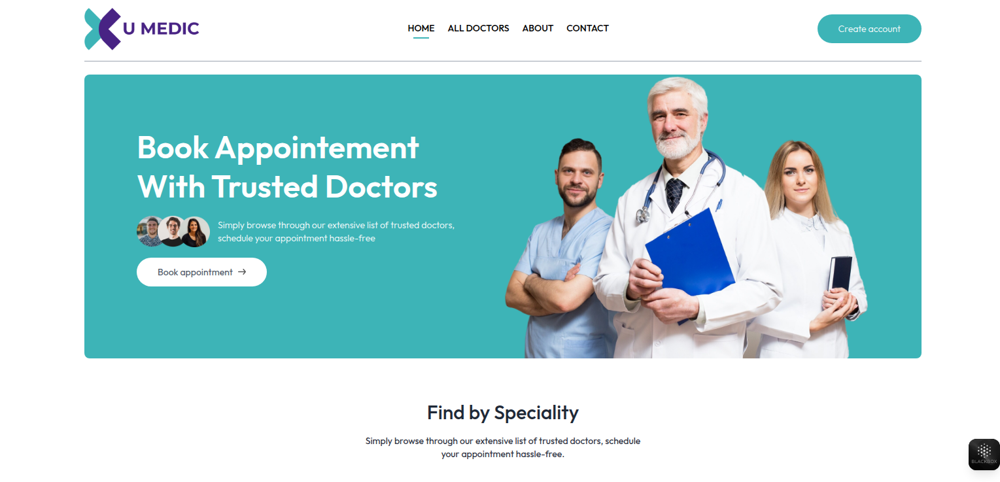
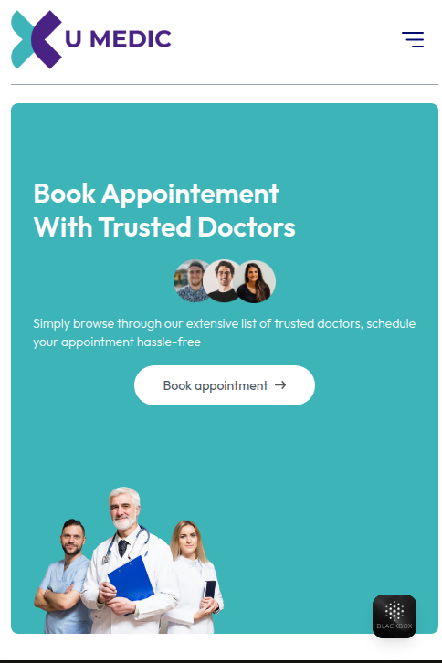

🩺 U-MEDIC – Doctor Appointment Booking Platform
U-MEDIC is a full-stack medical appointment booking web application that allows users to find trusted doctors, view specialities, and book appointments online. The platform also integrates secure online payments via PayPal for a smooth and hassle-free experience.

⚙️ Tech Stack
Frontend: React.js (with modern UI and reusable components)

Backend: Express.js (Node.js)

Database: MongoDB (for storing doctor/user/appointment data)

Payment Integration: PayPal

✨ Key Features
🧑‍⚕️ Browse a list of trusted doctors by speciality

📅 Book appointments online

🔒 Secure account creation and login

💳 Integrated PayPal payment method

📱 Fully responsive design

📸 Preview
### 🖥️ Desktop View

### 📱 Mobile View

